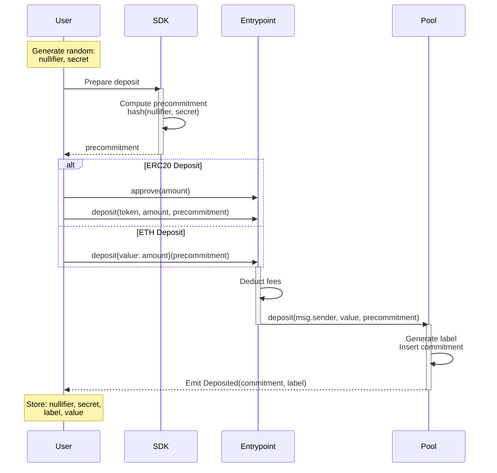
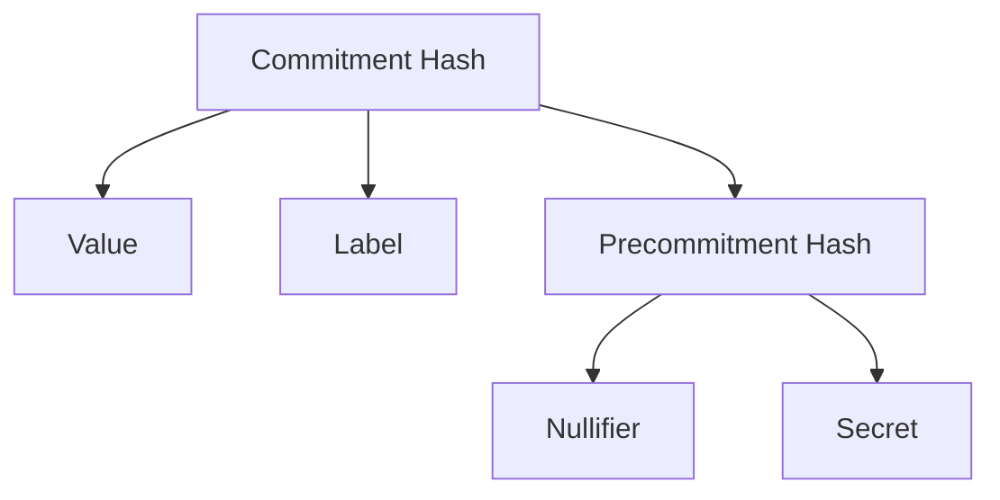

The deposit operation is the entry point into the Privacy Pool protocol. It allows users to publicly deposit assets (ETH or ERC20 tokens) into a pool, creating a private commitment that can later be used for private withdrawals or public ragequit operations.

## Protocol Flow

### Commitment Structure

The deposit process creates a commitment with the following structure:

### Parameters

| Parameter       | Description                                                                     |
| --------------- | ------------------------------------------------------------------------------- |
| `value`         | The deposit amount after fees                                                   |
| `label`         | `keccak256(scope, nonce)` where scope is pool-specific and nonce is incremental |
| `nullifier`     | Random value used to create unique commitments                                  |
| `secret`        | Random value that helps secure the commitment                                   |
| `precommitment` | Hash(nullifier, secret)                                                         |

### Deposit Steps

1. **Input Preparation**

- User generates random `nullifier` and `secret` values
- User computes `precommitment = hash(nullifier, secret)`

1. **Deposit Transaction**

- User calls Entrypoint's deposit function with asset, amount, and precommitment
- For ETH: `deposit(precommitment)` with ETH value
- For ERC20: `deposit(token, amount, precommitment)` after approval

1. **Fee Processing**

- Entrypoint calculates and retains vetting fee (configurable per pool)
- Remaining amount is forwarded to pool

1. **Commitment Generation**

- Pool generates unique `label` using scope and incremental nonce
- Computes commitment hash using value, label, and precommitment
- Inserts commitment into state Merkle tree

### Fee Structure

- Vetting fee: Configurable percentage (in basis points) taken by Entrypoint
- Example: 100 basis points = 1% fee
