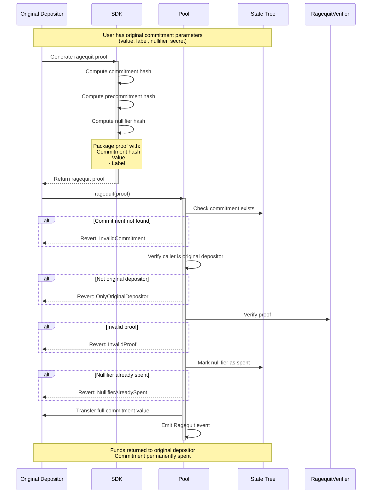

Ragequit is a safety mechanism that allows the original depositor to publicly withdraw their funds without needing ASP approval. This operation serves as a critical backup withdrawal method which ensures the ability to withdraw user funds when the label is not approved by the ASP or its approval was revoked (removed from the approved labels set).

## Protocol Flow

### Ragequit steps

1. Check Requirements
   - Must be original depositor
   - Commitment must not be already spent
2. Generate Proof
3. Call the `ragequit` method with the proof
4. Finalized ragequit
   - User received the full commitment amount
