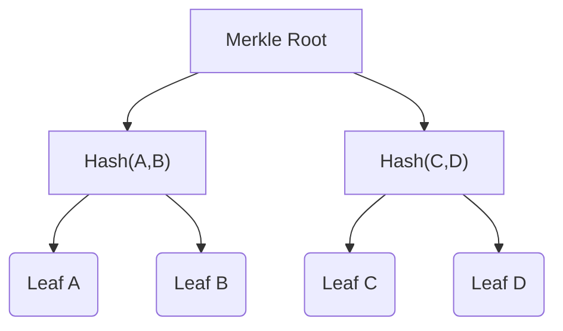

# Cryptographic Primitives

## Hash Functions

The Privacy Pool protocol uses the Poseidon hash function for various purposes, including:

- Hashing secrets
- Hashing commitments
- Building merkle trees

Poseidon is a custom hash function designed for efficient use in zero-knowledge proof systems.

## Merkle Trees

The Privacy Pool protocol uses a variant of merkle trees called Lean Incremental merkle Trees (LeanIMT). LeanIMTs are designed to efficiently support insertion and updating of leaves while maintaining a minimal tree depth. They are used for the following purposes:

- Representing the state of a Privacy Pool (commitments)
- Representing the ASP's association set (approved deposit labels)

Merkle trees enable efficient verification of inclusion proofs, which are used in the withdrawal processe to prove the existance of a commitment or label without revealing the its value.
