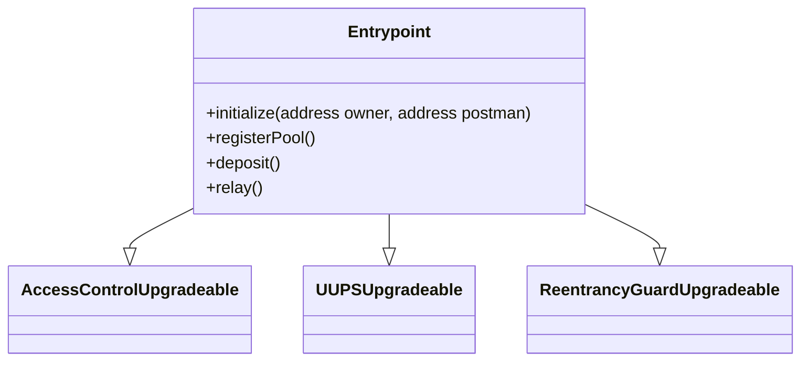

# Entrypoint Dependencies

## OpenZeppelin Contracts

### Access Control

```solidity
import {AccessControlUpgradeable} from '@oz-upgradeable/access/AccessControlUpgradeable.sol';
```

Provides role-based access control mechanism with upgradeable support. Enables:

- Granular permission management
- Role-based function access
- Dynamic role assignment and revocation

### Proxy

```solidity
import {UUPSUpgradeable} from '@oz-upgradeable/proxy/utils/UUPSUpgradeable.sol';
```

Implements Universal Upgradeable Proxy Standard (UUPS):

- Allows contract logic upgrades
- Maintains contract state during upgrades
- Provides secure upgrade authorization mechanism

### Security

```solidity
import {ReentrancyGuardUpgradeable} from '@oz-upgradeable/utils/ReentrancyGuardUpgradeable.sol';
```

Protects against reentrancy attacks:

- Prevents recursive call exploitation
- Adds `nonReentrant` modifier to critical functions
- Ensures atomic transaction execution

### Token Standards

```solidity
import {IERC20} from '@oz/interfaces/IERC20.sol';
import {SafeERC20} from '@oz/token/ERC20/utils/SafeERC20.sol';
```

Enables robust ERC20 token interactions:

- Standard interface for token operations
- Safe token transfer methods
- Protection against malformed token implementations

## Internal Dependencies

### Libraries

```solidity
import {Constants} from './lib/Constants.sol';
import {ProofLib} from './lib/ProofLib.sol';
```

Internal utility libraries:

- `Constants`: Protocol-specific constant values
- `ProofLib`: Zero-knowledge proof utility functions
- Standardizes protocol-wide configurations

### Interfaces

```solidity
import {IEntrypoint} from 'interfaces/IEntrypoint.sol';
import {IPrivacyPool} from 'interfaces/IPrivacyPool.sol';
```

Defines contract interaction standards:

- `IEntrypoint`: Core protocol interaction methods
- `IPrivacyPool`: Privacy pool contract interface
- Ensures consistent contract communication

## Inheritance Structure



### Inheritance Breakdown

- `AccessControlUpgradeable`: Role management
- `UUPSUpgradeable`: Contract upgradability
- `ReentrancyGuardUpgradeable`: Security protection

## Dependency Rationale

- Maximizes code reuse from battle-tested OpenZeppelin libraries
- Provides enterprise-grade security mechanisms
- Enables flexible, upgradeable contract architecture
- Standardizes critical protocol interactions

## Security Considerations

- All dependencies undergo extensive community audits
- Minimizes custom implementation of complex security patterns
- Leverages industry-standard smart contract libraries
