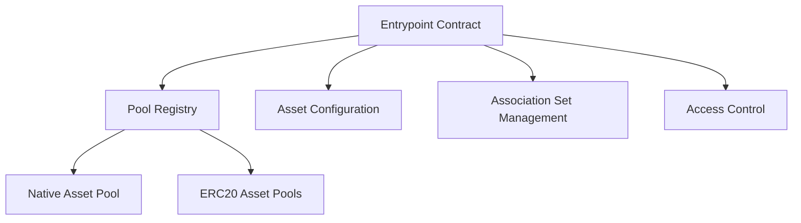
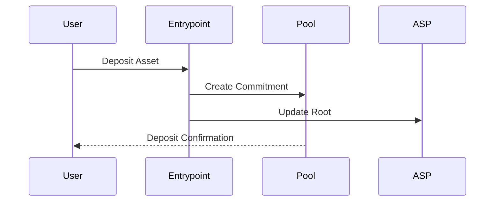

# Entrypoint Contract Overview

## Purpose and Functionality

The Entrypoint contract serves as the central coordination mechanism for the Privacy Pool protocol, managing:

- Pool registration and configuration
- Cross-asset deposit and withdrawal operations
- Association Set Provider (ASP) root management
- Protocol-wide access control and governance

## Architecture

## Key Features

### Pool Management

- Register and configure privacy pools for different assets
- Set minimum deposit amounts
- Define vetting fees for each pool
- Support both native (ETH) and ERC20 token pools

### Asset Handling

- Cross-asset deposit mechanism
- Fee deduction during deposits
- Relay withdrawals across different asset types
- Maintain asset-specific pool configurations

### Access Control

- Owner role for protocol management
- Postman role for updating Association Set roots
- Role-based access to critical protocol functions
- Prevents unauthorized modifications

## Upgrade Pattern

### UUPS Implementation

- Uses UUPS (Universal Upgradeable Proxy Standard)
- Enables future protocol improvements
- Allows seamless contract upgrades
- Maintains state and storage layout

### Upgrade Process

- Only owner can authorize upgrades
- New implementation must pass compatibility checks
- Minimal disruption to existing protocol state
- Preserves all existing data and configurations

## Security Mechanisms

- Extensive access control checks
- Minimum deposit and fee enforcement
- Prevent zero-address vulnerabilities
- Strict validation of pool registration parameters

## Protocol Interactions

## Key Methods

- `deposit()`: Handle asset deposits
- `relay()`: Process withdrawals
- `registerPool()`: Add new privacy pools
- `updateRoot()`: Update Association Set roots
- `windDownPool()`: Disable a specific pool

## Governance Considerations

- Centralized management through owner role
- Flexible configuration of protocol parameters
- Ability to respond to emerging security requirements
- Controlled upgrade path for protocol evolution

## Performance Characteristics

- Minimal gas overhead for deposit/withdrawal
- Efficient pool and asset management
- Scalable architecture supporting multiple asset types
