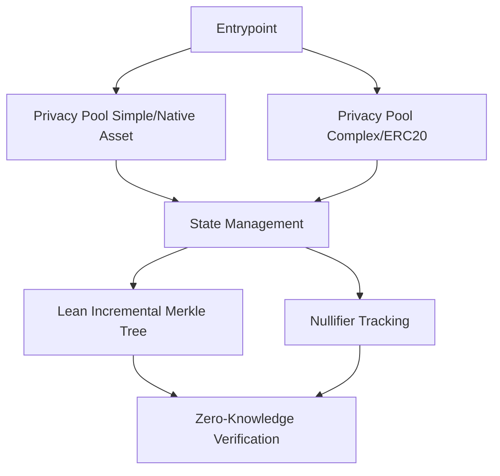
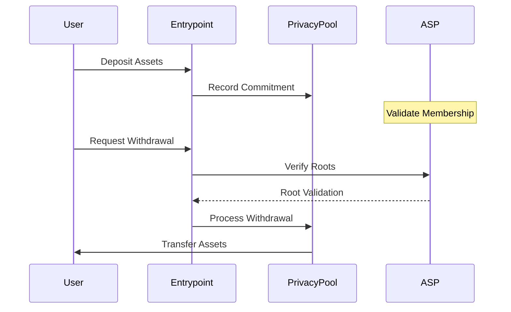

# Privacy Pool Overview

## Purpose and Functionality

### Core Purpose

The Privacy Pool contract provides a secure, privacy-preserving mechanism for asset withdrawals that:

- Enables confidential transactions
- Prevents transaction tracing
- Allows partial or full withdrawals
- Supports both native and ERC20 assets

### Privacy Features

Privacy is achieved through multiple sophisticated mechanisms:

- Zero-knowledge proofs for withdrawal verification
- Nullifier tracking to prevent double-spending
- Association Set Provider (ASP) root validation
- Cryptographic commitment scheme
- Incremental Merkle Tree for state management

## Architecture

## Key Components

### State Management

- Tracks deposit and commitment states
- Implements a circular buffer for root history (30 roots)
- Supports deposit cooldown and ragequit mechanisms
- Handles nullifier status tracking

### Merkle Tree Implementation

The contract uses a Lean Incremental Merkle Tree (LeanIMT) with unique properties:

- Dynamic depth
- Balanced tree construction
- Efficient insertion and proof generation
- Optimized for zero-knowledge protocols

Key Tree Properties:

- Every node with two children is a hash of left and right nodes
- Single-child nodes have the same value as their child
- Tree always builds from leaves to root
- Supports efficient membership proofs

### Zero-Knowledge Verification

- Uses Groth16 proof verification
- Validates withdrawals without revealing transaction details
- Checks:
  1. Proof cryptographic integrity
  2. Nullifier not previously spent
  3. Commitment exists in state
  4. ASP root validation

## Implementation Variants

### Simple Implementation (Native Asset)

- Handles native blockchain currency (e.g., ETH)
- Direct asset transfer mechanism
- Minimal additional complexity
- Specific error handling for native asset transfers

#### Key Characteristics

- Native asset-specific pull/push methods
- No token approval required
- Directly manages blockchain currency

### Complex Implementation (ERC20)

- Supports any ERC20 token
- Uses SafeERC20 for transfer safety
- More complex asset interaction
- Requires token approval

#### Key Characteristics

- Token-specific transfer methods
- Handles ERC20 token interactions
- Supports multiple token standards

## Contract Interactions

## Security Mechanisms

1. Role-Based Access Control

   - Owner role for critical configurations
   - Postman role for ASP root updates
   - Prevents unauthorized contract modifications

2. Nullifier Prevention

   - Unique nullifier per withdrawal
   - Tracking prevents double-spending
   - Cryptographically secure generation

3. Proof Verification
   - Groth16 zero-knowledge proof validation
   - Comprehensive proof checks
   - Prevents fraudulent withdrawals

## Performance Considerations

- O(log n) complexity for most operations
- Batch insertion optimization
- Minimal on-chain computational overhead
- Efficient state root management

## Upgradability

- UUPS (Universal Upgradeable Proxy Standard) support
- Allows future protocol improvements
- Controlled upgrade process via owner role

## Limitations and Constraints

- Maximum tree depth of 32
- Snark scalar field constrains input values
- Requires trusted setup for zero-knowledge circuits
